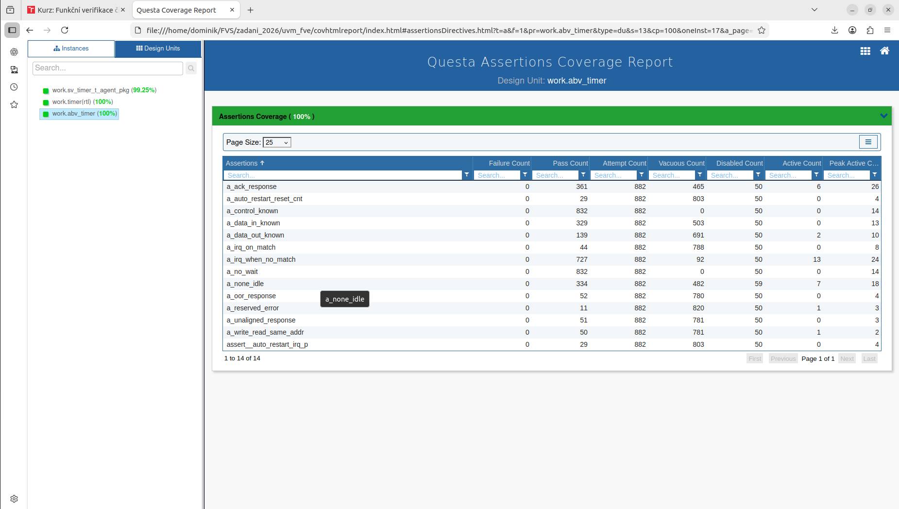
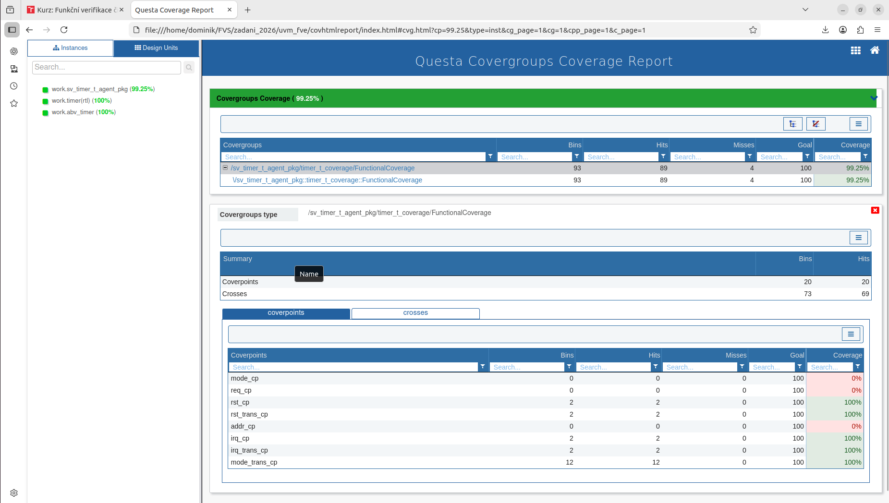
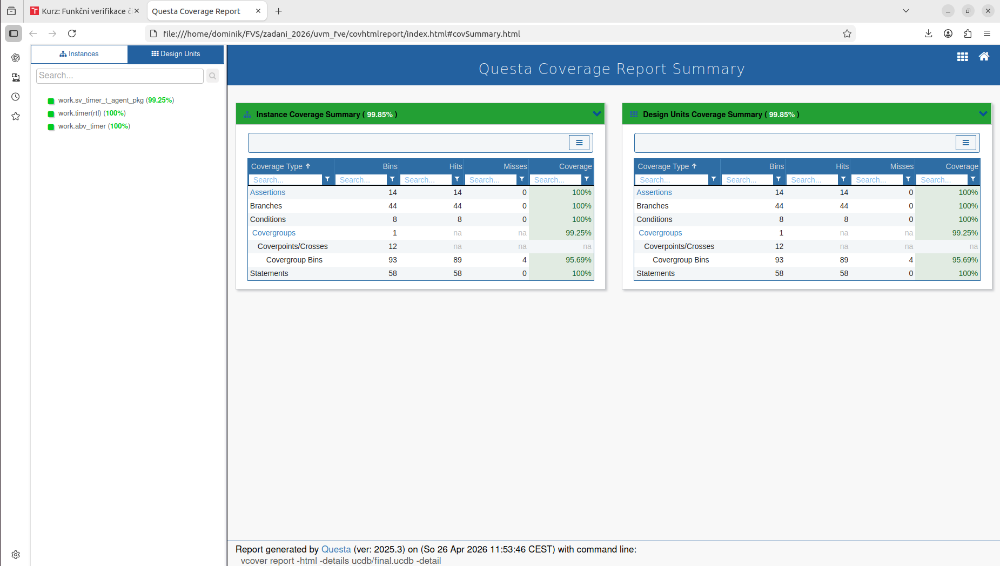
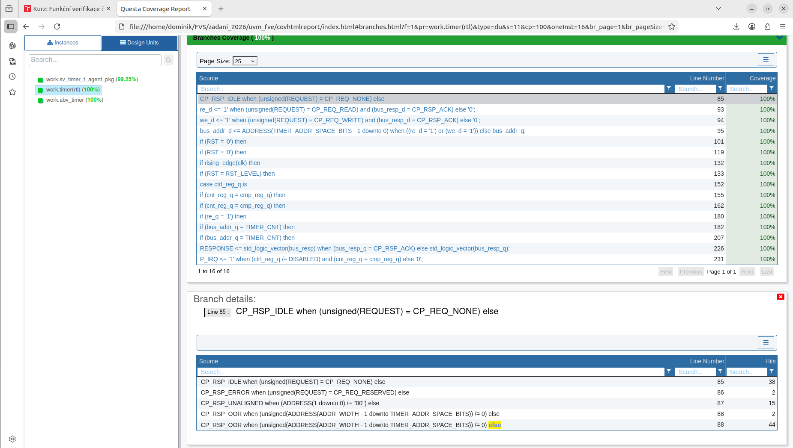

# TIMER Module Verification

## Verification Goal

The goal of this project was to verify the RTL implementation of the timer against the assignment specification. The verification focused on registers `cnt_reg`, `cmp_reg`, `ctrl_reg` and `cycle_cnt`, bus interface responses, interrupt generation on `P_IRQ`, reset behavior, and transitions between the timer modes `DISABLED`, `AUTO_RESTART`, `ONE_SHOT` and `CONTINOUS`.

## Verification Plan

All timer modes were verified:

- `DISABLED`: the counter does not increment and no interrupt is generated.
- `AUTO_RESTART`: when `cnt_reg == cmp_reg`, an interrupt is generated and the counter is reset to zero.
- `ONE_SHOT`: when the match occurs, an interrupt is generated, the counter is reset to zero and the timer switches to `DISABLED`.
- `CONTINOUS`: when the match occurs, an interrupt is generated and the counter continues running.

At the interface level, requests `CP_REQ_NONE`, `CP_REQ_READ`, `CP_REQ_WRITE` and `CP_REQ_RESERVED` were verified, including `RESPONSE` behavior, reads and writes to all register addresses, accesses outside the timer address space, unaligned addresses and unused aligned addresses inside the timer address space.

At the structural level, statement, branch, condition and assertion coverage were tracked. The additional test `addr_bus_branch_cover_t_test` was added to cover the read branch for an unused aligned address inside the timer address space.

## Tests

The regression test set is listed in `test_lib/test_list`:

- `timer_t_test`
- `random_t_test`
- `autorestart_t_test`
- `oneshot_t_test`
- `disabled_t_test`
- `continuous_t_test`
- `mode_transition_t_test`
- `full_access_t_test`
- `reset_stress_t_test`
- `edge_cases_t_test`
- `addr_bus_branch_cover_t_test`
- `full_cov_t_test`
- `formal_t_test`
- `reg_t_test`
- `muj_prvni_t_test`
- `continous_t_test`

The additional regression tests cover the assertion/formal-oriented stress scenario, register model frontdoor access, a helper smoke scenario over the mode-setting sequences, and the compatibility alias for the misspelled continuous test name. Older superseded source files, such as `ADDR_BUS_BRANCH_COVER_TEST.svh`, `mujprvnitest.svh` and `mode_transition_test.svh`, are not used directly because their functionality is covered by the renamed or fixed tests listed above.

The pseudo-random test uses constraints according to the assignment:

- `RST`: inactive value with weight 20, active value with weight 1.
- `ADDRESS`: timer registers have weights 7, 6, 5, 2, 2 and all other addresses are distributed with weight 1.
- `REQUEST`: `NONE`, `READ`, `WRITE`, `RESERVED` have weights 10, 5, 5, 1.
- `DATA_IN`: value 0 has weight 10, values 1 to 20 have weight 20 and high values are distributed with weight 1.

## Functional Coverage

The following coverage points were tracked:

- reset values and reset transitions,
- register addresses,
- request types,
- `P_IRQ` value and transitions,
- interrupt behavior in individual modes,
- transitions between modes,
- address/request/reset/mode combinations.

Some basic coverpoints (`mode_cp`, `req_cp`, `addr_cp`) have `option.weight = 0`. The evaluated bins are covered by directed tests and additional coverage-oriented sequences.

## Formal Assertions

The ABV assertions check:

- absence of `X/Z` values on control and data signals,
- `ACK`, `IDLE`, `ERROR`, `OOR` and `UNALIGNED` responses,
- absence of `WAIT` response generation,
- correct `P_IRQ` generation,
- `AUTO_RESTART` behavior when the counter reaches the compare value,
- correct read-after-write behavior for the same address.

## Coverage Report Results

The implemented verification suite achieves almost full coverage. Most metrics, including assertions, branches, conditions and statements, reach 100%. Functional coverage through covergroups reaches 99.25%. The remaining uncovered functional coverage, 0.75%, corresponds to combinations that were not activated during testing, most likely because of their low probability in the pseudo-random test. The RTL code and ABV assertions are fully covered.

## Fixes in `timer_fvs.vhd`

The original implementation did not match the golden model implemented according to the specification. Therefore, the response priority was adjusted to match the expected model behavior, even though this differs from the wording in the assignment. The relevant fixes are around lines 85-95.

During verification, several RTL details had to be aligned with the expected timer behavior. In `timer_fvs.vhd`, the design now explicitly distinguishes the NONE request `CP_REQ_NONE`, the RESERVED request, unaligned addresses, addresses outside the timer address space and valid accesses with the `ACK` response.

Reads and writes to internal registers are gated by a valid `ACK`. This prevents invalid requests, invalid addresses and unaligned accesses from changing the timer state. The behavior of an unused aligned address inside the timer address space was also covered: the access is acknowledged, but the read data remains at the default value. This was the reason for adding the `addr_bus_branch_cover_t_test`.

## Conclusion

The implemented verification suite covers the main timer functional scenarios, bus interface corner cases, reset behavior, all timer modes and transitions between them. In the latest run, neither the scoreboard nor ABV reported any errors.
